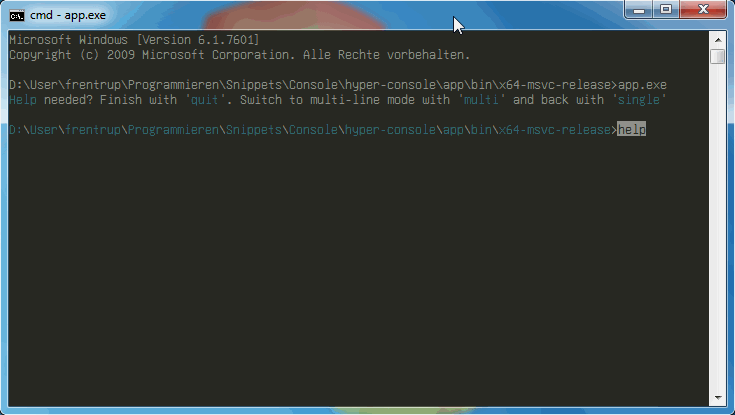

# README #

This library implements advanced Win32 console input with hyperlinks, mouse and clipboard support. 

This software is available under the *GNU Library General Public License (LGPL 2.0)*, see [LICENSE.md](LICENSE.md).

### Features ###

* Unicode-only
* Single-line and multi-line input
* Mouse and keyboard selection
* [Clickable links](#Clickable-links) anywhere in the output (can be clicked during `hyper_console_readline()`)
* [Search console](#Find-text) output with Ctrl+F
* Clipboard support via Ctrl+C, Ctrl+X, Ctrl+V
* Select any part of the console window with mark mode (mouse or Ctrl+M): 
  - Rectangle selection with pressed Alt key, otherwise line selection. 
  - during mark mode: Tab to select next/previous link. Space to click current link.
* Highlight matching bracket
* surround selection with (...), [...], "..." when one of these delimiters is entered.
* Input history
* Customizable auto-completion with Tab/Shift+Tab/Esc
* Customizable keyboard shortcuts

### Goals/TODO ###

* (customizable) syntax highlighting

## The example app in action ##

The hyper-console library comes with an example app.exe to showcase its possibilities.

### Clickable links ###

Before you can write clickable hyperlinks, you need to call `hyper_console_init_hyperlink_system()`. 
To clean up, call `hyper_console_done_hyperlink_system()` at program termination.

You create clickable links by first calling `hyper_console_start_link(const wchar_t *title)` with a hover text (you need to `fflush(stdout)` before calling this). 
Then you can write text with `wprintf()` etc. and set the current link's destination with `hyper_console_set_link_input_text(const wchar_t *text)`. 

The hyperlink ends when you call `hyper_console_end_link()` (again, you need to `fflush(stdout)` before calling this).

Links are clickable during `hyper_console_readline()`. 
Whenever a link is activated, its destination text replaces the input line and `hyper_console_readline()` returns that text.

### Find text

During `hyper_console_readline()`, you can search the screen buffer with CTRL+F. 
This shortcut enters Search Mode with the currently selected text as search term. 
You can modify the search term via keyboard (input and cursor position: LEFT, RIGHT, SHIFT+LEFT, etc.). 

Pressing CTRL+F again goes to the next occurence (searching upwards), CTRL+SHIFT+F the the previous (downwards). 
Search Mode ends after pressing ESC or by selecting some text with the mouse.

### Clipboard support

During `hyper_console_readline()`, you can select lines of text with the mouse or keyboard (SHIFT+LEFT, UP, etc.). 
Via keyboard, selection is initially restricted to the current input line, but may be extended by explicitly entering Mark Mode with CTRL+M.

By default, lines of text are selected. 
You may select a rectangular block of text by holding the ALT key while performing the selection.

When text is selected, CTRL+C copies it to the Windows clipboard and clears the selection. 
If the selection is within the current input line, CTRL+X cuts it to the clipboard. CTRL+V pastes text from the clipboard.

